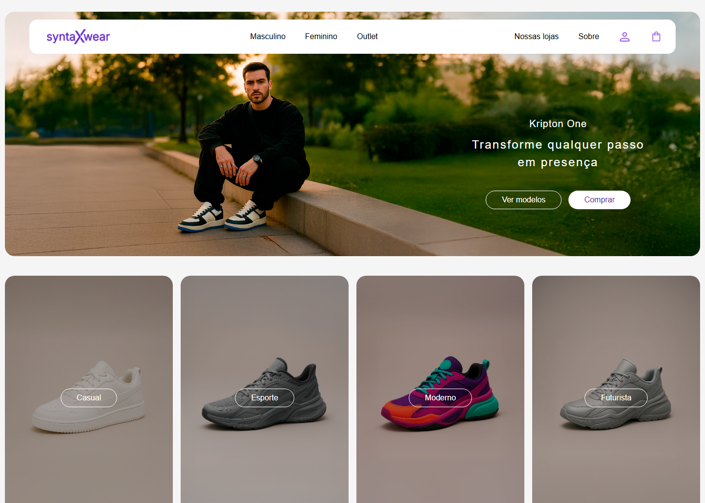

# 👕 Syntax Wear App

O **Syntax Wear** é um protótipo moderno de uma loja virtual (e-commerce) focado em moda urbana e calçados. O projeto foi construído utilizando as ferramentas mais atuais do ecossistema React para oferecer uma experiência de usuário fluida, rápida e responsiva.

Este projeto foi desenvolvido como parte de um portfólio front-end, demonstrando boas práticas de organização de código, roteamento avançado e estilização moderna.

## 📷 Screenshot



## 🔗 Links

- Solução no Repositório: [Acesse o repositório aqui](https://github.com/jsales25/syntax-wear-app.git)
- Live Site: [Acesse o site aqui](https://syntax-wear-app-chi.vercel.app/)

## 🚀 Tecnologias Utilizadas

Este projeto utiliza o que há de mais moderno no desenvolvimento web:

- **React 19:** A versão mais recente da biblioteca para criação de interfaces.
- **Vite 7:** Uma ferramenta de build extremamente rápida para o desenvolvimento.
- **TypeScript:** Adiciona tipagem ao JavaScript, ajudando a evitar erros comuns e facilitando a manutenção.
- **Tailwind CSS 4:** Framework de estilização baseado em utilitários que permite criar designs incríveis rapidamente.
- **TanStack Router:** Um roteador poderoso para React que garante navegação rápida e segura entre as páginas.
- **React Hook Form + Zod:** Utilizados para criar formulários inteligentes com validações automáticas.

## ✨ Funcionalidades

- **🛒 Carrinho de Compras:** Adição e remoção de produtos com gerenciamento de estado via Context API.
- **🗺️ Roteamento Dinâmico:** Páginas de produtos, categorias e institucional (Sobre Nós, Nossas Lojas) organizadas de forma eficiente.
- **📝 Formulários com Validação:** Login, Cadastro e consulta de CEP com feedback em tempo real para o usuário.
- **📱 Design Responsivo:** Interface que se adapta perfeitamente a dispositivos móveis e desktops.
- **🔍 Galeria de Imagens:** Exibição detalhada dos produtos.

## 🛠️ Como rodar o projeto

Para rodar este projeto no seu computador, você precisará ter o [Node.js](https://nodejs.org/) instalado.

### Passos:

1.  **Clone o repositório:**
    ```bash
    git clone https://github.com/seu-usuario/syntax-wear-app.git
    ```

2.  **Entre na pasta do projeto:**
    ```bash
    cd syntax-wear-app
    ```

3.  **Instale as dependências:**
    ```bash
    npm install
    ```

4.  **Inicie o servidor de desenvolvimento:**
    ```bash
    npm run dev
    ```

5.  **Acesse no navegador:**
    O terminal mostrará um endereço (geralmente `http://localhost:5173`). Abra esse link para ver o projeto funcionando!

## 📂 Estrutura de Pastas Principal

- `src/assets`: Imagens, ícones e fontes do projeto.
- `src/components`: Componentes reutilizáveis da interface (Botões, Cards, Header, Footer).
- `src/contexts`: Gerenciamento de estado global (ex: Carrinho).
- `src/pages`: As diferentes telas do aplicativo organizadas por rotas.
- `src/styles`: Configurações de cores e estilos globais com Tailwind CSS.
- `src/utils`: Funções de utilidade (como formatar moeda ou validar CPF).

## 📝 Licença

Este projeto é para fins de estudo e portfólio. Sinta-se à vontade para explorar e aprender com ele!
## 👩‍💻 Autor

**Julia Sales**

- **GitHub:** [Acesse o GitHub da autora aqui](https://github.com/jsales25)
- **Frontend Mentor:** [Acesse o Frontend Mentor da autora aqui](https://www.frontendmentor.io/profile/jsales25)
- **LinkedIn:** [Acesse o LinkedIn da autora aqui](https://www.linkedin.com/in/julia-sales-developer/)

---

<div align="center">
  Feito com 💜 por Julia Sales
</div>

